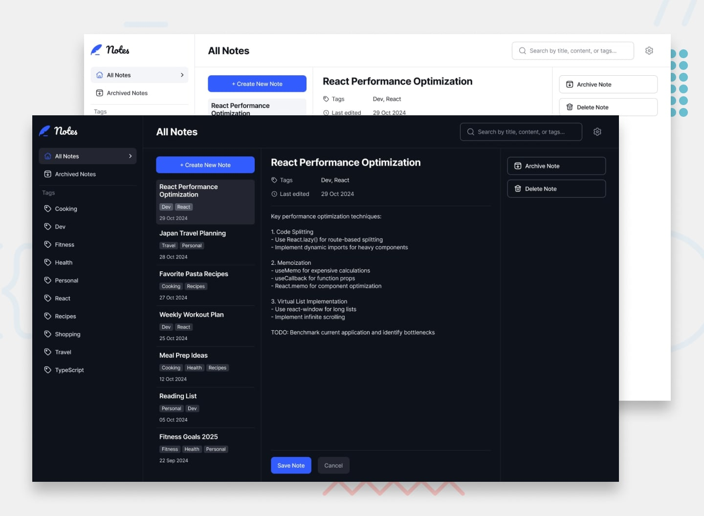

# Note-taking App

A **Note-taking App** built with Flutter, designed to help you capture and organize your ideas effortlessly. Create, edit, and manage notes with a user-friendly interface tailored for both mobile and desktop platforms.

## Table of Contents

- [Preview](#preview)
- [Features](#features)
- [Download](#download)
- [Design](#design)
- [License](#license)

## Preview

## Features

- **Rich Text Editing**: Create notes with bold, italic, underline, and other formatting options.
- **Categorization**: Organize notes using customizable tags.
- **Search Functionality**: Quickly find notes using the built-in search feature.
- **Offline Access**: Access and edit notes without an internet connection.
- **Cross-Platform**: Optimized for seamless use on both mobile and desktop devices.

## Download

Download the latest version of the app from the **[Releases Page](https://github.com/JER3MIAH/note_taking_app/releases)**.

### Installation

#### For Mobile (Android)

1. Download the `.apk` file from the [latest release](https://github.com/JER3MIAH/note_taking_app/releases).
2. Transfer the file to your Android device, or download it directly on your device.
3. Open the file and follow the on-screen instructions to install the app.
   - Ensure that "Install from Unknown Sources" is enabled in your device settings.

#### For Desktop (Windows)

1. Download the `.exe` file from the [latest release](https://github.com/JER3MIAH/note_taking_app/releases).
2. Run the installer and follow the setup instructions.
3. Launch the app and start taking notes!

## Design

The app's design was inspired by concepts from [Frontend Mentor](https://www.frontendmentor.io), ensuring a modern and intuitive user interface.

## License

This project is licensed under the MIT License. See the [LICENSE](LICENSE) file for more details.

